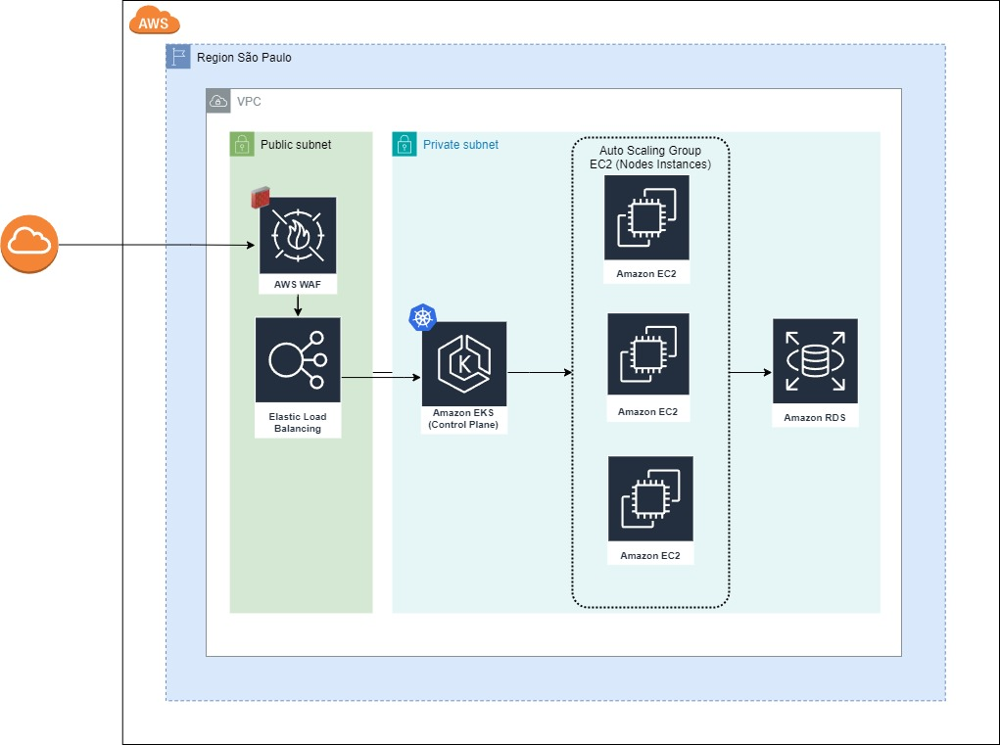

# g37-lanches

[](https://pkg.go.dev/golang.org/x/example)

Serviço de controle de pedidos desenvolvido em Golang.

## Tech Stack

**API:** Go

**Infra:** PostgreSQL

<br/>

## Requisitos

- go 1.20
- docker
- kubernetes cluster (Docker desktop)
- kubectl

<br/>

## Execução com Docker Compose

Build image

```bash
  docker build -t g37-lanches-api:latest .
```

Subir dependências
```bash
  docker-compose up -d
```

Rodar aplicação
```bash
  docker run -e ENVIRONMENT=dev -e POSTGRES_HOST=localhost -e POSTGRES_PORT=5432 -e POSTGRES_DB=g37_lanches -e POSTGRES_SSLMODE=disable -e POSTGRES_USER=admin -e POSTGRES_PASSWORD=admin -p 8080:8080 --network="host" g37-lanches-api:latest
```
<br/>

## Execução com Kubernetes

Entrar na pasta do Kubernetes
```bash
  cd k8s
```

Criar Persistent Volume
```bash
  kubectl apply -f pv-volume.yaml
```

Criar Persistent Volume Claim
```bash
  kubectl apply -f pv-claim.yaml
```

Criar Postgres Config Map
```bash
  kubectl apply -f postgres-config-map.yaml
```

Criar Postgres Service
```bash
  kubectl apply -f postgres-service.yaml
```

Criar Postgres Deployment
```bash
  kubectl apply -f postgres-deployment.yaml
```

Criar API Service
```bash
  kubectl apply -f api-service.yaml
```

Criar API Deployment
```bash
  kubectl apply -f api-deployment.yaml
```

## Documentação
[Documentation](https://github.com/IgorRamosBR/g37-techchallenge/tree/master/docs)


## Arquitetura
Clean Architecture com a estrutura de pastas baseada no [Standard Go Project Layout](https://github.com/golang-standards/project-layout#go-directories) 

```bash
├── cmd
├── configs
├── docs
├── internal
|   |── api
|   |── controllers
|   ├── core
|   │   ├── entities
|   │   ├── usecases
|   ├── infra
|   │   ├── drivers
|   │   ├── gateways
├── k8s
├── migrations
```

## Arquitetura na AWS
